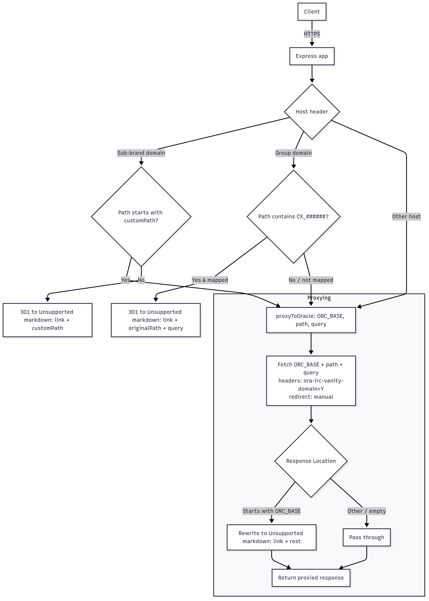
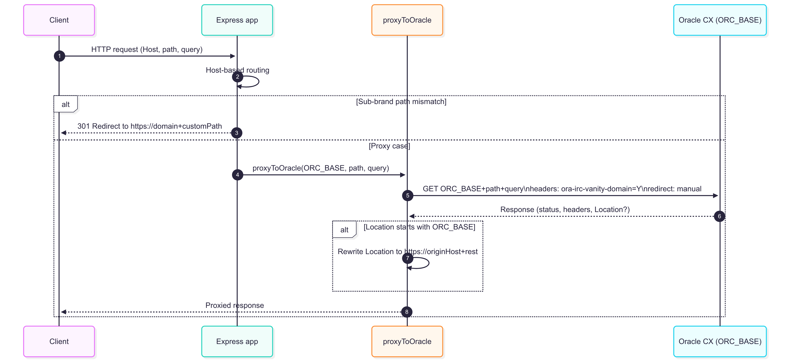

## Oracle CX Vanity Proxy Server   

A minimal Node/Express reverse proxy that provides vanity-domain routing for Oracle Recruiting Cloud Candidate Experience (ORC CX). It normalizes paths for sub-brands, supports CX code → domain redirects for the group domain, and transparently proxies traffic to Oracle while rewriting redirect `Location` headers to keep users on the original vanity domain.

### Features   

- **Host-based routing**: Routes behavior by the `Host` header (`GROUP_DOMAIN`, `SUB_BRAND_DOMAINS`, or other).
- **Sub-brand path enforcement**: Ensures each sub-brand domain lands on its configured CX site path; otherwise issues a `301` to the correct path.
- **CX code mapping**: On the group domain, `CX_######` codes are mapped to their respective sub-brand domains and redirected with `301`.
- **Reverse proxy to ORC**: Forwards requests to `ORC_BASE` with header `ora-irc-vanity-domain: Y`, handles redirects manually, and rewrites Oracle `Location` headers back to the originating vanity domain.
- **Simple, single file**: All logic in `index.js`.

### Quick start 

1. **Install**

```bash
npm install
```

2. **Run**

```bash
npm start
```

3. **Environment**

- **PORT**: Optional. Defaults to `8080`.

4. **Test locally with Host header**

```bash
# Example: simulate a sub-brand request against localhost
curl -i -H "Host: azw.orcdemo.work" http://localhost:8080/

# Example: simulate the group domain with a CX code in path
curl -i -H "Host: careers.vision-vanity.com" http://localhost:8080/en/sites/CX_77006
```

### Configuration 

Edit constants in `index.js`:

- **`ORC_BASE`**: Oracle CX base URL.
- **`GROUP_DOMAIN`**: Vanity group domain.
- **`SUB_BRAND_DOMAINS`**: Array of supported sub-brand domains.
- **`subdomainPaths`**: Map of sub-brand domain → required CX site path.
- **`cxToDomainMap`**: Map of `CX_######` code → sub-brand domain.

### Request handling logic 

- **If `Host` ∈ `SUB_BRAND_DOMAINS`**:
  - If request path starts with that domain's `customPath`: proxy to Oracle.
  - Else: `301` redirect to `https://{domain}{customPath}`.
- **Else if `Host` = `GROUP_DOMAIN`**:
  - If path contains `CX_######` and a mapping exists: `301` to `https://{mappedDomain}{originalPath}{query}`.
  - Else: proxy to Oracle.
- **Else (any other host)**: proxy to Oracle.


### Architecture Diagram



### UML Diagram


### File structure

```text
proxyserver/
  ├─ index.js             # Express proxy and routing logic
  ├─ package.json         # Dependencies and start script
  └─ package-lock.json
```

### Notes and considerations

- **Redirect semantics**: Path normalization and CX code routing use `301` to preserve SEO signals for canonical vanity URLs.
- **Header handling**: The proxy sets `ora-irc-vanity-domain: Y` and forwards `Content-Type`. `Location` is rewritten when it targets `ORC_BASE`.
- **Extensibility**: To add a new sub-brand, update `SUB_BRAND_DOMAINS`, `subdomainPaths`, and (optionally) `cxToDomainMap`.
- **Security**: This proxy trusts the inbound `Host` header. In production, terminate TLS at a trusted edge and ensure correct `Host` forwarding.


